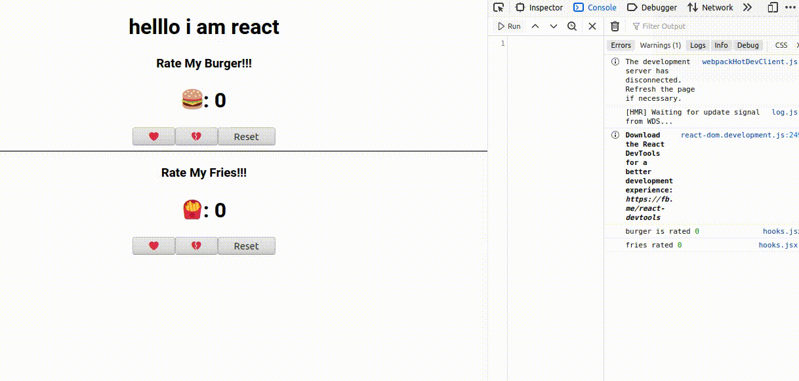

Here I Use ReactHooks from Basic Hooks(useState, useEffect,useContext)


In the project directory, you can run:

### `cd myhooks`

### `npm start`

Runs the app in the development mode.<br />
Open [http://localhost:3000](http://localhost:3000) to view it in the browser.

The page will reload if you make edits.<br />
You will also see any lint errors in the console.

### Here you can see the demo : 

 


### {useState}

with this one you can simply set state without a class in this way :

```javascript
import React, { useState } from "react";

const Myhooks = () => {
  const [burger, setBurger] = useState(0);
  const [fries, setFries] = useState(0);

```
___
1. Here {useState} can take two argument directly:
  first one is value , and second one is the state which you want to update.
  so you d'nt need to have a class to update a state or setState or this.setState or any lengthy code to set it.
  you can also set it within a button to set which will be the next updated state by clicking. 
  ```javascript
  <button onClick={() => setBurger(burger + 1)}>❤️</button>
  ```
___

2. Suppose you need to set what will be the next after updating this state. I mean you need to set events or more argument to    pass.In that case you need to use {useEffect}. This is like a magic box. It will work as like same of two different functions:   {componentDidupdate,componentDidmount}  
 ```javascript
 useEffect(() => {
    console.log("burger is rated", burger);
  });
 ```
 Now , It will call after any state as their , I d'nt set the dependencies there.. If I want that ,It will call when only the burger will rate. In that case I have to set the dependency their like: 
 ```javascript
 useEffect(() => {
    console.log("burger is rated", burger);
  }, [burger]);
 ```
 [] , with this third bracket I have set the dependency. Actually it takes an array list of dependencies. If we set nothing in it , that means we are saying that "you dot need to think of the dependency, you will call every time after any event."
 
  
